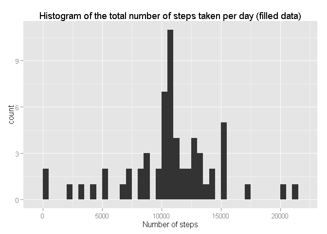

# Reproducible Research: Peer Assessment 1


## Loading and preprocessing the data

First of all, I loaded the data by **read.csv** command and I changed the format of date column to Date format 
(instead of Factor).


```r
data <- read.csv("activity.csv", sep = ",", na.strings = "NA")
data$date <- as.Date(data$date, format = "%Y-%m-%d")
```

## What is mean total number of steps taken per day?

I created a new dataset without the missing values.


```r
steps_without_na <- data[!is.na(data$steps),]
```

Then I calculated the total number of steps taken per day by **aggregate** function and named columns appropriately.


```r
sum_steps <- aggregate(steps_without_na$steps, by = list(steps_without_na$date), FUN = sum)
colnames(sum_steps) <- c("date", "steps")
```

Then I made a **histogram** of the total number of steps taken each day. For the graphics, I used **ggplot2** package
in the whole project.


```r
library(ggplot2)
qplot(steps, data = sum_steps, binwidth = 500) + labs(title = "Histogram of the total number of steps taken per day", x = "Number of steps")
```

\

I calculated the **mean** and **median** total number of steps taken per day by mean and median functions.


```r
mean_steps <- mean(sum_steps$steps)
median_steps <- median(sum_steps$steps)

print(mean_steps)
```

```
## [1] 10766.19
```

```r
print(median_steps)
```

```
## [1] 10765
```

From the histogram we can see that the mean and median could be very close to each other and they should be slightly
bigger than 10 000. So that hypothesis was confirmed.

## What is the average daily activity pattern?

First of all, I calculated the average number of steps taken each 5-minute interval by **aggregate** function and
named columns appropriately.


```r
average <- aggregate(steps_without_na$steps, by = list(steps_without_na$interval), FUN = mean)
colnames(average) <- c("interval", "steps")
```

Then I made a time series plot of the 5-minute interval (x-axis) and the average number of steps taken, 
averaged across all days (y-axis). Again, I used **ggplot2** package.


```r
ggplot(data = average, aes(interval, steps)) + geom_line() + labs(title = "The average daily activity pattern", x = "Time interval", y = "Number of steps")
```

\

Then I identified the 5-minute interval with the maximum number of steps (I made it by **which.max** function).


```r
interval_max <- average$interval[which.max(average$steps)]
print(interval_max)
```

```
## [1] 835
```

This confirmed my hypothesis that the maximum number of steps was taken in the morning, around 8:00 (I can see that from the graph).

## Imputing missing values

We can see that there are a number of days (or intervals) with missing values (coded as **NA**). Because the presence of missing values could lead to biased results, it is good to impute them somehow.

First of all, I calculated the total number of missing values in the dataset.


```r
miss <- sum(is.na(data$steps))
print(miss)
```

```
## [1] 2304
```

There are 2304 missing values from the total number of 17568 observations. We can count the percentage of missing values in the whole dataset.


```r
miss/nrow(data)
```

```
## [1] 0.1311475
```

There is about 13% of missing values which is quite a lot. So we need to fill in all of the missing values. I chose the strategy that used the **mean** of the appropriate 5-minute interval.

First of all, I identified which rows of the original dataset contained missing value.


```r
which_miss <- which(is.na(data$steps))
```

Then I created a new dataset by copying the original one. Later on, it would contain the missing values filled in.


```r
data_filled <- data
```

I took the mean of the appropriate interval and filled in the missing values in the new dataset. I used **for loop** to do this.


```r
for (i in seq_along(which_miss)){
    data_filled$steps[which_miss[i]] <- average$steps[average$interval == data_filled$interval[which_miss[i]]]
}
```

Then I calculated the total number of steps taken each day (as I did it before) but with the new data.


```r
sum_steps_filled <- aggregate(data_filled$steps, by = list(data_filled$date), FUN = sum)
colnames(sum_steps_filled) <- c("date", "steps")
```

I used this data to make a **histogram** of the total number of steps taken per day.


```r
qplot(steps, data = sum_steps_filled, binwidth = 500) + labs(title = "Histogram of the total number of steps taken per day (filled data)", x = "Number of steps")
```

\

Furthermore, I calculated the **mean** and **median** total number of steps taken per day (with the filled data).


```r
mean_steps_filled <- mean(sum_steps_filled$steps)
median_steps_filled <- median(sum_steps_filled$steps)
```

I created a table with the original mean and median and the new ones calculated from the filled data so they could be easily compared.


```r
mean_median <- data.frame(c(mean_steps, mean_steps_filled), c(median_steps, median_steps_filled))
rownames(mean_median) <- c("original data", "filled data")
colnames(mean_median) <- c("mean", "median")
print(mean_median)
```

```
##                   mean   median
## original data 10766.19 10765.00
## filled data   10766.19 10766.19
```

So we can see that the mean did not change (that is because I used the mean of the 5-minute interval to fill in the missing values) and the median changed a little bit (it is slightly bigger but I think it is insignificant). So we can say that we did not change the general character of the data.

## Are there differences in activity patterns between weekdays and weekends?

I need to distinguish between weekdays and weekend in this part. I used the package **timeDate** to do this. It contains a function called **isWeekday** (or **isWeekend**) which returns TRUE for weekdays and FALSE for weekend (or vice versa).


```r
library(timeDate)
type <- isWeekday(data_filled$date)
type[type == TRUE] <- "weekday"
type[type == FALSE] <- "weekend"
```

I created a new variable **type** which I added to the existing dataset (with filled data) and transformed it to a factor.


```r
data_filled$type <- as.factor(type)
```

Then I calculated the average number of steps for each 5-minute interval for weekdays and weekends. Again, I used function **aggregate** to do this.


```r
average_type <- aggregate(data_filled$steps, by = list(data_filled$interval, data_filled$type), FUN = mean)
colnames(average_type) <- c("interval", "type", "steps")
```

Finally, I made a **panel plot** containing a time series plot of the 5-minute interval (x-axis) and the average number of steps taken, averaged across all weekday days or weekend days (y-axis). I used **ggplot2** package as before.


```r
ggplot(data = average_type, aes(interval, steps)) + geom_line() + 
    labs(title = "The average daily activity pattern for weekdays and weekends", x = "Time interval", y = "Number of steps") + facet_grid(type~.)
```

\

From the plot we can see the differences between weekdays and weekends. For example people make more steps earlier in the morning during weekdays and more steps later in the evening during weekends. In general, people make more steps at weekends (during the whole day), the only exception is in the morning about 8:00 when people make more steps at weekdays.
